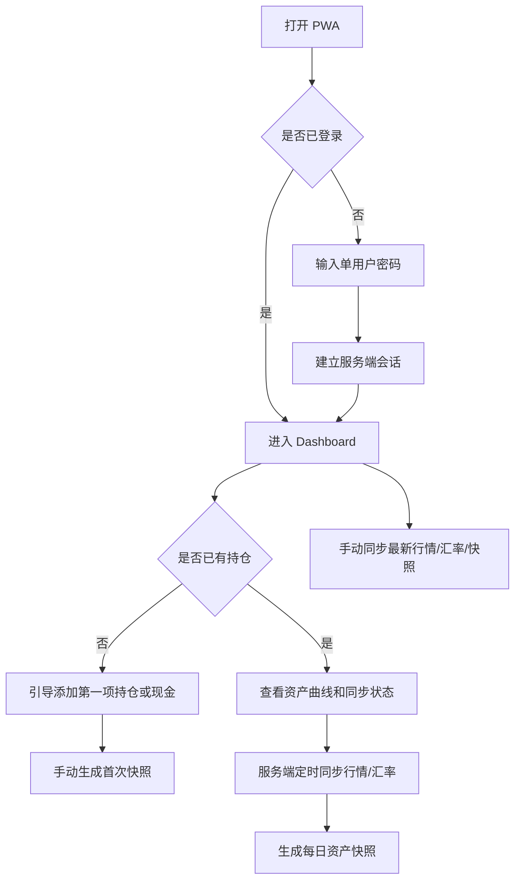

# 个人资产净值追踪 Web PWA PRD

版本：v1.0  
日期：2026-06-22  
建议形态：单用户 Web PWA + Next.js + Postgres/Supabase + 单用户密码登录 + 服务端行情同步  
项目定位：个人资产记账与每日净值追踪工具。产品仅用于个人资产记录、估值展示和数据导出，不提供投资建议、不代客交易、不展示买卖推荐。

## 1. 背景与目标

用户希望在 iPhone Safari 和主屏幕 PWA 中快速查看个人资产净值、收益变化、持仓明细、现金流、定投执行情况，并尽量减少每日手工维护成本。

现阶段产品从“微信小程序 + CloudBase”改为“单用户 Web PWA + Next.js + Postgres/Supabase”。核心原则是：

- 优先适配 iPhone Safari 和添加到主屏幕后运行的 PWA。
- 只服务单个个人用户，不开放注册，不做公开多用户账号体系。
- 提供登录界面，通过密码阻止他人访问。
- 用户手动维护持仓、现金流和定投计划。
- 系统在服务端自动同步最新行情和汇率。
- API key、行情源凭据和同步日志只保存在服务端。
- 账户 ID、内部 ID、数据库主键等不暴露给用户。
- 暂不接入 IBKR 官方同步；IBKR 相关资产先通过手动持仓 + 自动行情/汇率估值完成。

## 2. 用户与使用场景

### 2.1 目标用户

唯一用户：个人资产所有者。关注跨平台资产净值、投资收益、资产配置、资金流入流出和历史曲线。

### 2.2 典型场景

- 每天打开 iPhone 主屏幕 PWA，查看总资产、收益和资产曲线。
- 新增或调整支付宝基金、建行黄金、股票、现金等持仓。
- 记录买入、卖出、申购、赎回、入金、出金、分红、利息、手续费等现金流。
- 设置基金定投计划，让系统按计划生成待确认或已执行的定投记账记录。
- 手动触发行情和汇率同步，或重新生成当日快照。
- 导出资产、持仓、现金流、快照数据，用于备份或后续分析。

## 3. 产品范围

### 3.1 MVP 必做

- iPhone Safari 和主屏幕 PWA 适配。
- 登录页和单用户密码登录。
- 登录态保持、退出登录、会话过期处理。
- Dashboard：首页展示资产总览、收益、曲线、同步状态。
- 资产曲线范围：1W、1M、6M、1Y、ALL，交互参考 IBKR 风格。
- 账户管理：用户可维护资产来源的展示名称和类型，但不看到系统内部 ID。
- 持仓管理：基金、黄金、股票、现金、自定义资产。
- 现金流管理：买入、卖出、申购、赎回、入金、出金、分红、利息、手续费、税费、手动调整。
- 定投计划：创建、暂停、恢复、结束，自动生成计划内现金流或待确认记录。
- 服务端行情同步：东方财富公开数据、Alpha Vantage、Frankfurter。
- 手动同步：用户可从同步页触发最新行情、汇率和当日快照生成。
- 每日定时同步：服务端定时拉取行情、汇率并生成每日资产快照。
- 数据导出：CSV 或 JSON，至少包含账户、持仓、现金流、定投计划、每日快照。
- 数据状态提示：快照时间、价格时间、汇率时间、是否使用历史价格、是否同步失败。

### 3.2 暂不做

- 用户注册、公开多用户账号、邀请、家庭资产共享。
- 微信登录、微信小程序、CloudBase 云函数、CloudBase 数据库。
- 自动登录支付宝、建行或任何银行/券商个人账户。
- IBKR 官方 API、OAuth、Flex Web Service 自动同步。
- 交易下单、投资建议、选基、荐股、择时提醒。
- 银行卡余额自动读取。
- 高频实时行情。
- 税务报表、复杂绩效归因。

### 3.3 后续可选

- IBKR 官方同步。
- 多币种绩效分析 TWR/MWR。
- 更细的资产分类和标签体系。
- 本地加密备份或端到端导出包。

## 4. 成功指标

- 用户可在 10 分钟内完成首次登录、录入第一批资产并生成第一张快照。
- PWA 添加到 iPhone 主屏幕后，核心页面无明显布局溢出、遮挡或横向滚动。
- 每日服务端同步任务可稳定生成资产快照。
- 首页可清晰展示总资产、投资收益、累计投入本金、资产曲线和数据更新时间。
- 用户可手动修正持仓、现金流、价格或快照。
- 所有第三方 API key 只存在服务端环境变量或服务端密钥配置中，不进入浏览器包、localStorage、前端日志或导出文件。
- 同步失败时历史数据仍可查看，且界面能明确提示失败来源。

## 5. 信息架构

### 5.1 页面结构

- `/login`：登录页。
- `/` 或 `/dashboard`：资产总览首页。
- `/holdings`：持仓列表与编辑。
- `/accounts`：资产账户管理。
- `/cashflows`：现金流记录。
- `/plans`：定投计划。
- `/sync`：行情、汇率、快照同步状态与手动同步。
- `/export`：数据导出。
- `/settings`：密码修改、显示偏好、货币偏好、PWA 信息、风险提示。

### 5.2 底部导航

iPhone 优先使用底部 Tab：

- 首页
- 持仓
- 现金流
- 定投
- 同步
- 设置

空间不足时，“导出”可放在设置页内。

## 6. 核心用户流程



## 7. 登录与安全

### 7.1 登录模式

- 产品只有一个使用者。
- 不提供注册入口。
- 不提供找回密码邮件流程。
- 初始密码通过部署环境变量或初始化脚本设置。
- 登录成功后服务端创建 HttpOnly、Secure、SameSite=Lax 的会话 Cookie。
- 浏览器端不保存明文密码。
- 支持退出登录，退出后清除会话。
- 支持在设置页修改密码。

### 7.2 访问控制

- 所有业务 API 必须校验服务端会话。
- 未登录访问业务页面时跳转到 `/login`。
- API 未登录返回 401。
- 所有写操作在服务端执行，不信任前端传入的内部 ID 归属。
- 单用户系统仍保留服务端鉴权中间件，避免未来扩展时形成安全债务。

### 7.3 不暴露内部 ID

- 页面、表单、导出文件默认不显示数据库主键、账户 ID、持仓 ID、现金流 ID、内部用户 ID。
- URL 不使用内部自增 ID 作为用户可见路径参数；如需详情页，可使用短 slug 或服务端映射。
- 错误提示不包含数据库表名、SQL、内部 ID、第三方 API URL 中的 key。

## 8. 页面需求

### 8.1 Login 登录页

用途：阻止他人访问个人资产数据。

展示内容：

- 产品名称：个人资产追踪
- 密码输入框
- 登录按钮
- 登录失败提示
- 风险提示入口

交互要求：

- 支持 iPhone Safari 密码自动填充。
- 输入错误时展示通用错误：“密码不正确或登录已失效”，不要泄露更多信息。
- 连续失败可做简单节流。
- 登录成功后跳转 Dashboard。

验收标准：

- 未登录不能访问任何业务页面和业务 API。
- 刷新页面后登录态仍可保持。
- 退出登录后返回登录页。

### 8.2 Dashboard 首页

用途：展示每日资产概览和历史走势。

展示内容：

- 总资产估值，默认折算为 CNY。
- 今日或最近快照投资收益。
- 累计投资收益。
- 累计投入本金。
- 投资收益率。
- 资产分类占比：基金、黄金、股票、现金、自定义。
- 总资产曲线。
- 可选曲线指标：总资产、累计收益、累计投入本金、收益率。
- 曲线范围：1W、1M、6M、1Y、ALL。
- 最近一次快照时间。
- 最近一次行情同步时间。
- 最近一次汇率同步时间。
- 数据状态：完整、部分缺失、使用历史价格、使用历史汇率、同步失败。
- 手动同步入口。

交互要求：

- 时间范围切换使用分段控件，顺序固定为 1W、1M、6M、1Y、ALL。
- 曲线交互参考 IBKR：触摸后显示日期、总资产、收益、收益率。
- 点击资产分类进入对应持仓筛选。
- 点击同步状态进入同步页。
- 无数据时显示空状态，引导添加第一项持仓。

验收标准：

- 资产曲线可按 1W、1M、6M、1Y、ALL 正确过滤。
- 同步失败不影响历史曲线展示。
- 使用历史价格或历史汇率时，首页必须明确提示。
- iPhone 竖屏下首屏可看到总资产、核心收益数字和曲线入口。

### 8.3 持仓页

用途：展示和维护当前资产明细。

持仓类型：

- 基金：支付宝基金等，用户手动维护份额和成本，行情使用东方财富公开数据。
- 黄金：建行黄金或其他黄金资产，用户手动维护克数和成本，价格使用公开黄金报价或手动价。
- 股票/ETF：A 股、港股、美股等，用户手动维护数量和成本，行情优先 Alpha Vantage；A 股/基金可优先东方财富公开数据。
- 现金：CNY、USD、AUD、HKD 等现金余额。
- 自定义资产：无法自动获取行情的资产，允许手动维护估值。

通用字段：

- 展示名称
- 资产类型
- 市场/交易所，可为空
- 代码或标识，可为空
- 币种
- 持有数量、份额、克数或余额
- 平均成本或累计成本
- 所属账户展示名称
- 是否计入总资产
- 备注
- 当前价格
- 当前市值
- 浮动收益
- 浮动收益率
- 价格来源
- 价格更新时间

交互要求：

- 新增、编辑、归档持仓。
- 添加相关现金流。
- 查看单个持仓的历史估值曲线。
- 不向用户展示内部持仓 ID。
- 删除优先设计为归档，避免破坏历史快照。

验收标准：

- 手动录入持仓后可立即生成估值。
- 行情缺失时允许用户输入手动价格。
- 股票持仓不依赖 IBKR 同步。

### 8.4 账户页

用途：按资产来源组织持仓。

账户类型：

- 支付宝基金
- 建行黄金
- IBKR 手动
- 银行现金
- 现金钱包
- 自定义

字段：

- 账户展示名称
- 账户类型
- 默认币种
- 是否计入总资产
- 备注

交互要求：

- 新建、编辑、停用账户。
- 查看账户下持仓。
- 用户只看到展示名称，不看到账户 ID。

### 8.5 现金流页

用途：记录影响收益计算的资金流入流出和交易事件。

现金流类型：

- 买入
- 卖出
- 申购
- 赎回
- 入金
- 出金
- 分红
- 利息
- 手续费
- 税费
- 汇率换算
- 定投记账申购
- 手动调整

字段：

- 关联持仓展示名称，可为空
- 关联账户展示名称，可为空
- 类型
- 金额
- 币种
- 数量/份额变化，可为空
- 交易日期
- 费用，可为空
- 备注
- 数据来源：手动、定投计划、导入、系统调整

交互要求：

- 新增、编辑、删除现金流。
- 按日期、资产类型、账户、现金流类型筛选。
- 现金流变更后提示用户重新生成受影响日期之后的快照。

验收标准：

- 入金、出金不应被误算为投资收益。
- 买入、卖出、申购、赎回能影响持仓成本、数量和本金计算。

### 8.6 定投页

用途：管理基金或其他资产的定投记账计划。

字段：

- 计划名称
- 关联持仓
- 每期金额
- 币种，MVP 默认 CNY
- 频率：每周、每两周、每月
- 执行日：周几或每月几号
- 开始日期
- 结束日期，可为空
- 手续费率，可为空
- 下次执行日期
- 状态：启用、暂停、结束
- 备注

执行逻辑：

- 服务端定时任务检查到期计划。
- 到期后生成一条“定投记账申购”现金流，状态可为待确认或已确认。
- 若当日基金净值不可用，先记录金额，份额待净值可用后补算。
- 用户可手动确认、修改或撤销自动生成记录。

验收标准：

- 暂停计划不会继续生成现金流。
- 恢复计划后按下一次执行日继续。
- 定投只是记账模拟，不代表真实申购交易。

### 8.7 同步页

用途：让用户了解行情、汇率和快照生成状态，并手动触发同步。

展示内容：

- 最新行情同步时间。
- 最新汇率同步时间。
- 最新快照生成时间。
- 最近同步任务列表。
- 每个任务的状态：成功、部分成功、失败、运行中。
- 数据源：东方财富公开数据、Alpha Vantage、Frankfurter、手动价格。
- 失败原因摘要。

交互要求：

- 手动同步行情。
- 手动同步汇率。
- 手动生成/重新生成当日快照。
- 手动重试失败任务。
- 同步按钮需要 loading 和防重复点击。

验收标准：

- API key 不返回给前端。
- 用户可看见哪个数据源失败，但看不见密钥、完整请求头或内部堆栈。
- 手动同步完成后 Dashboard 数据可刷新。

### 8.8 数据导出页

用途：用户主动备份和分析个人数据。

导出范围：

- 账户
- 持仓
- 现金流
- 定投计划
- 每日资产快照
- 行情价格历史
- 汇率历史

格式：

- MVP 支持 CSV。
- 可选支持 JSON。

要求：

- 导出必须由用户主动触发。
- 导出文件不包含密码哈希、会话、API key、内部数据库主键。
- 如需关联数据，使用展示名称、代码、日期等可读字段。

## 9. 行情与汇率

### 9.1 数据源

- 东方财富公开数据：优先用于中国基金、A 股、部分指数或公开可取的中文市场数据。
- Alpha Vantage：用于美股、ETF、外股或补充行情。API key 只在服务端环境变量中配置。
- Frankfurter：用于外汇汇率。优先拉取与 CNY 相关的 USD、AUD、HKD 等汇率。
- 手动价格：当自动行情不可用时，允许用户手动输入价格。

### 9.2 服务端同步原则

- 所有第三方 API 请求都从服务端发起。
- 浏览器端不直接请求东方财富、Alpha Vantage 或 Frankfurter。
- 服务端封装 provider 层，统一返回标准价格结构。
- 记录原始数据源、价格日期、抓取时间和是否为历史价格。
- 对 API 限流、失败、空数据做重试和降级。
- Alpha Vantage key 不得进入前端 bundle、页面 HTML、日志、导出文件。

### 9.3 同步频率

- 每日自动同步：建议在主要市场收盘后运行一次。
- 汇率同步：每日一次，必要时手动触发。
- 手动同步：用户从同步页触发，服务端排队或直接执行。
- 若当日价格不可得，可使用最近可用价格，并标记 `priceStale=true`。
- 若当日汇率不可得，可使用最近可用汇率，并标记 `fxStale=true`。

## 10. 快照与收益计算

### 10.1 估值口径

默认展示币种为 CNY。

```text
持仓原币市值 = 持有数量 * 最新可用价格
持仓 CNY 市值 = 持仓原币市值 * 原币兑 CNY 汇率
当日总资产 = 所有计入总资产持仓的 CNY 市值合计
```

现金资产：

```text
现金 CNY 市值 = 现金余额 * 现金币种兑 CNY 汇率
```

### 10.2 投资收益

```text
当日净流入 = 入金 + 新增投入 - 出金 - 提取
当日投资收益 = 当日总资产 - 前一快照总资产 - 当日净流入
累计投入本金 = 初始投入本金 + 期间累计净流入
累计投资收益 = 当前总资产 - 累计投入本金
累计投资收益率 = 累计投资收益 / 累计投入本金
```

要求：

- 总资产曲线允许因入金、出金变化。
- 投资收益曲线必须扣除现金流影响。
- 快照保存原币金额、汇率、折算后金额、价格日期和同步状态。
- 重新生成历史快照时需要明确影响范围，避免无提示改写全部历史。

### 10.3 资产曲线范围

Dashboard 曲线必须支持：

- 1W：最近 7 天。
- 1M：最近 1 个月。
- 6M：最近 6 个月。
- 1Y：最近 1 年。
- ALL：全部快照。

若某范围内数据点过少：

- 仍展示可用点。
- 明确提示“该范围内历史快照较少”。
- 不伪造历史数据。

## 11. 数据模型建议

数据库：Postgres，优先使用 Supabase 托管 Postgres。即便是单用户系统，也建议表结构保持清晰、可迁移。

建议表：

- `app_settings`：单用户配置、默认币种、显示偏好。
- `auth_users`：单用户登录信息，保存密码哈希，不保存明文密码。
- `sessions`：服务端会话，可选；也可使用框架内置 session store。
- `accounts`：资产账户展示信息。
- `holdings`：持仓。
- `cashflows`：现金流。
- `investment_plans`：定投计划。
- `prices`：行情价格历史。
- `fx_rates`：汇率历史。
- `daily_snapshots`：每日总资产快照。
- `snapshot_items`：每日持仓级快照明细。
- `sync_jobs`：同步任务状态、时间、provider、错误摘要。
- `manual_price_overrides`：手动价格修正。

关键要求：

- 数据库主键使用 UUID 或自增 ID 均可，但不直接暴露给用户。
- 金额使用 decimal/numeric，避免浮点误差。
- 所有时间保存 timezone-aware timestamp。
- 所有业务表保留 `created_at`、`updated_at`。
- 归档字段优先于硬删除，例如 `archived_at`。

## 12. 技术方案

### 12.1 前端

- Next.js App Router。
- TypeScript。
- PWA：manifest、service worker、主屏幕图标、启动图适配。
- UI 优先适配 iPhone Safari 竖屏。
- 图表可使用 ECharts、Recharts、Visx 或其他适合移动端触摸交互的库。
- 表单使用受控组件和服务端校验。
- 敏感数据不放入 localStorage。

### 12.2 后端

- Next.js Route Handlers 或 Server Actions 承载业务 API。
- Postgres/Supabase 存储业务数据。
- 服务端行情 provider：
  - `EastMoneyProvider`
  - `AlphaVantageProvider`
  - `FrankfurterProvider`
  - `ManualPriceProvider`
- 服务端 valuation service 负责估值、收益和快照生成。
- 定时任务可使用 Vercel Cron、Supabase Edge Functions、GitHub Actions 调用受保护 API，或部署平台自带 scheduler。
- 所有同步任务写入 `sync_jobs`。

### 12.3 环境变量

至少需要：

```text
DATABASE_URL
SESSION_SECRET
INITIAL_ADMIN_PASSWORD 或 PASSWORD_HASH
ALPHA_VANTAGE_API_KEY
CRON_SECRET
DEFAULT_DISPLAY_CURRENCY=CNY
```

要求：

- `.env` 不提交到仓库。
- 服务端读取 API key。
- 前端只可读取明确以 `NEXT_PUBLIC_` 开头且非敏感的配置。

### 12.4 建议目录

```text
app/
  login/
  dashboard/
  holdings/
  accounts/
  cashflows/
  plans/
  sync/
  export/
  settings/
  api/
    auth/
    dashboard/
    holdings/
    cashflows/
    plans/
    sync/
    export/

components/
  chart/
  forms/
  layout/
  navigation/
  sync-status/

lib/
  auth/
  db/
  providers/
    eastmoney.ts
    alpha-vantage.ts
    frankfurter.ts
    manual-price.ts
  valuation/
  export/
  types/

supabase/
  migrations/
```

## 13. PWA 与移动端体验

### 13.1 iPhone Safari 要求

- 支持添加到主屏幕。
- 设置正确的 app name、icons、theme color、viewport。
- 适配安全区 `safe-area-inset-bottom`，底部导航不被 Home Indicator 遮挡。
- 表单输入字号不低于 16px，避免 iOS 自动放大。
- 图表支持触摸 tooltip。
- 关键按钮触控区域不小于 44px。
- 首屏加载应有 skeleton 或轻量 loading。

### 13.2 离线与缓存

MVP 不要求完整离线编辑。

要求：

- PWA 可缓存静态资源。
- 网络不可用时提示“当前离线，仅可查看已加载数据”。
- 不在离线状态下静默写入关键财务数据，避免冲突。

## 14. 合规与风险提示

### 14.1 不允许的实现

- 不保存支付宝、建行、IBKR、银行、券商登录密码。
- 不模拟登录任何金融平台。
- 不绕过验证码、二次验证或风控系统。
- 不提供投资建议、收益承诺、买卖推荐。
- 不把 API key 放到前端。

### 14.2 首次使用提示

首次登录后应展示：

```text
本产品仅用于个人资产记录和估值展示，不构成投资建议。由于行情延迟、交易日差异、汇率波动和数据源限制，展示金额可能与支付宝、建行、IBKR 或其他官方平台不完全一致，请以官方平台显示和最终成交价格为准。
```

用户确认后再进入首次录入流程。

## 15. 非功能需求

### 15.1 性能

- Dashboard API P95 响应时间小于 2 秒。
- 200 条持仓、5000 条现金流、5 年每日快照范围内，移动端曲线交互不卡顿。
- 每日同步任务单次运行小于 60 秒；若超时，应拆分 provider 或分页执行。

### 15.2 可用性

- 同步失败不影响历史数据查看。
- 行情部分失败时仍可生成部分快照，但必须标记数据不完整。
- 手动价格可作为自动行情失败时的兜底。
- 现金流修改后可重新生成受影响快照。

### 15.3 可维护性

- 行情源封装为独立 provider。
- 估值和收益计算封装为独立 service。
- 数据库迁移可重复执行、可回滚。
- 所有 API 输入输出有 TypeScript 类型。
- 关键计算逻辑需要单元测试。

### 15.4 可观测性

- 每次同步写入 `sync_jobs`。
- 记录 provider、开始时间、结束时间、状态、错误摘要。
- 日志脱敏，不打印密码、session、API key、完整持仓导出内容。
- 关键失败可通过邮件、Webhook 或部署平台告警扩展。

## 16. 开发里程碑

### Milestone 1：基础框架与登录

- 创建 Next.js 项目。
- 接入 Postgres/Supabase。
- 建立数据库迁移。
- 完成单用户密码登录、会话、退出登录。
- 完成 PWA manifest、icons、移动端基础布局。
- 完成 Dashboard 空状态。

### Milestone 2：手动数据维护

- 账户管理。
- 持仓新增、编辑、归档。
- 现金流新增、编辑、删除。
- 定投计划新增、暂停、恢复、结束。
- 基础数据校验和错误提示。

### Milestone 3：行情、汇率与估值

- 接入东方财富公开数据 provider。
- 接入 Alpha Vantage provider。
- 接入 Frankfurter 汇率 provider。
- 实现手动价格兜底。
- 实现 valuation service。
- 生成每日快照和持仓级快照。

### Milestone 4：Dashboard 曲线与同步页

- 总资产、收益、本金、收益率展示。
- 资产曲线范围：1W、1M、6M、1Y、ALL。
- 资产分类占比。
- 同步状态展示。
- 手动同步行情、汇率和快照。
- 数据完整性提示。

### Milestone 5：导出、设置与上线准备

- CSV/JSON 导出。
- 修改密码。
- 显示偏好和涨跌颜色偏好。
- 风险提示确认。
- 日志脱敏。
- 移动端验收和 PWA 主屏幕验收。

## 17. 验收清单

- 用户访问业务页面时必须先登录。
- 产品不提供注册入口。
- 单用户密码登录可用，退出登录可用。
- iPhone Safari 可正常浏览核心页面。
- 添加到主屏幕后 PWA 可正常打开。
- 用户可新增账户，但看不到账户 ID 或内部 ID。
- 用户可新增基金、黄金、股票、现金和自定义持仓。
- 用户可记录现金流。
- 用户可创建、暂停、恢复、结束定投计划。
- 系统可按定投计划生成记账记录。
- 服务端可同步东方财富公开数据。
- 服务端可同步 Alpha Vantage 行情。
- 服务端可同步 Frankfurter 汇率。
- Alpha Vantage API key 只在服务端使用。
- 用户可手动触发行情、汇率和快照同步。
- 系统可生成每日资产快照。
- Dashboard 显示总资产、投资收益、累计投入本金、收益率和资产分类。
- 资产曲线支持 1W、1M、6M、1Y、ALL。
- 使用历史价格或历史汇率时，Dashboard 有明确提示。
- 同步失败时历史数据仍可查看。
- 用户可导出数据。
- 导出文件不包含密码哈希、session、API key 和内部数据库主键。
- 暂不做 IBKR 官方同步；IBKR 资产可通过手动持仓 + 自动行情/汇率估值管理。

## 18. 待确认问题

1. 默认展示货币是否固定为 CNY，还是需要支持 CNY/AUD 一键切换？
2. 黄金价格优先使用哪个公开口径：建行公开报价、上海金价，还是手动维护？
3. 东方财富公开数据的具体接口是否接受其稳定性和非官方性质？
4. Alpha Vantage 免费额度是否足够覆盖当前持仓规模？
5. 定投自动生成记录默认是“待确认”还是“已确认”？
6. 是否需要导入历史 CSV，还是 MVP 只做导出？
7. 密码忘记时是否通过服务器环境变量重置，而不做产品内找回？

## 19. 一句话开发原则

先把它做成一个安全、稳定、可解释、iPhone 上好用的个人资产净值账本；持仓由用户掌控，行情和汇率由服务端自动补齐，任何自动化都不能牺牲账户安全、数据可解释性和隐私边界。
